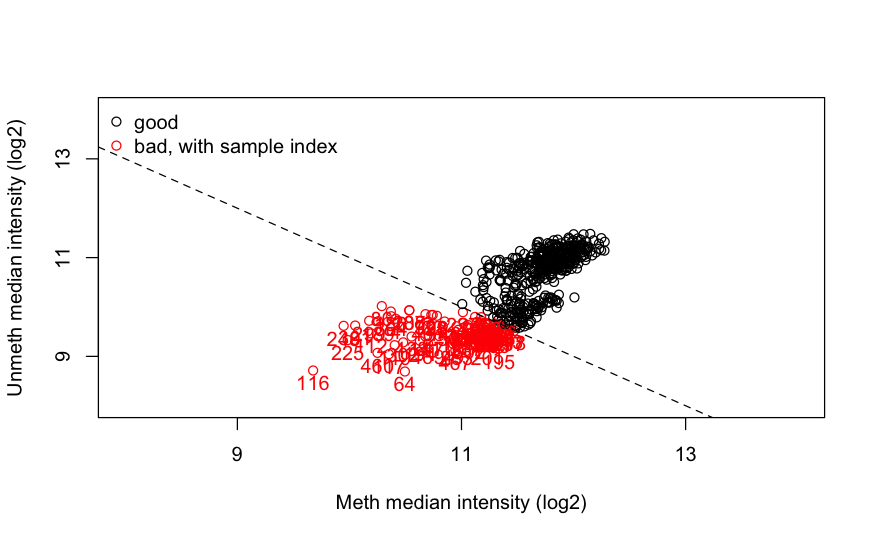

# Differential Methylation Analysis Example (PPMI MJJF Project 120)

### 1. Install the necessary packages for Normalization of raw Methylation profiling data (.idat) and Differential Analysis.

```{r}
BiocManager::install("minfi")
BiocManager::install("limma")
BiocManager::install("DMRcate")
BiocManager::install("missMethyl")
BiocManager::install("tidyverse")
```

## Preprocessing

### 2. Import the libraries

```{r}
library(tidyverse)
library(limma)
library(GEOquery)
library(illuminaio)
library(IlluminaHumanMethylation450kanno.ilmn12.hg19)
library(DMRcate)
library(missMethyl)
```

### 3. Prepare Clinical Data to be matched with Probes from Methylation Profile Data

```{r}
ppmi_meta <- read.csv("/Volumes/Elements/pd-methyl/ppmi/metaDataIR3.csv", stringsAsFactors = F)
ppmi_meth_120_txt <- read.delim("/Volumes/Elements/pd-methyl/ppmi/Project120_IDATS_n524final_toLONI_030718/PPMI_Meth_n524_for_LONI030718.txt", header=T, sep="\t")
ppmi_meta_baseline <- ppmi_meta[ppmi_meta$CLINICAL_EVENT == "BL",]
clinical_meta <- ppmi_meta_baseline %>% select(PATNO, DIAGNOSIS, GENDER)
sample_sheet <- merge(clinical_meta, ppmi_meth_120_txt, by = "PATNO")
sample_sheet$Basename <- paste0(sample_sheet$Sentrix.ID, "_", sample_sheet$Sentrix.Position)
sample_sheet$Sample_Group <- sample_sheet$DIAGNOSIS
sample_sheet <- sample_sheet %>% rename(Sentrix_Position = Sentrix.Position, Sentrix_ID = Sentrix.ID)
write.csv(sample_sheet, "/Volumes/Elements/pd-methyl/ppmi/Project120_IDATS_n524final_toLONI_030718/sample_sheet.csv", row.names = F)
```

#### cleanup

```{r}
rm(list = setdiff(ls(), c("sample_sheet")))
gc(full = TRUE)
```

### 4. Create a sample metadata table by reading the respective GSE file

```{r}
basedir <- "/Volumes/Elements/pd-methyl/ppmi/Project120_IDATS_n524final_toLONI_030718"
targets <- read.metharray.sheet(basedir, pattern = "sample_sheet.csv")

targets$Sample_Group <- factor(targets$DIAGNOSIS)
levels(targets$Sample_Group)
```

### 5. Read the raw intensity data from the .idat files

`extended = TRUE` reads the "extended" data from the .idat files - includes also the number of beads per probe. This information is necessary for calculating the p-values later on. rgdata holds the red and green channel data for all probes and all samples
```{r}
rg_set <- read.metharray.exp(targets = targets, extended = TRUE)
saveRDS(rg_set, "rg_set_ppmi.rds")
```

### 6. Perform initial quality control on raw data

i.  `preprocessRaw(rg_set)` -\> convert the green and red channel intensities `RGChannelSet` into methylated and unmethylated channel intensities (`MethylSet`) without normalization or background correction.
ii. `getQC()` -\> calculate quality control metrics from the `MethylSet`. Compute the median methylated and unmethylated intensities across all probes for each sample.
iii. `qc` -\> contains the median intensity values for each sample. Samples with low median intensities indicate poor quality or failed experiments.

```{r}
rm(qc, rg_set_filtered)
gc(full=T)
qc <- getQC(preprocessRaw(rg_set))
plotQC(qc)
```

### 7. Display the distribution of Methylation values across all samples

i.  Beta values are converted internally from raw intensities
ii. X-axis represents beta values (0=fully unmethylated; 1=fully methylated)
iii. It's good (quality) if samples from both groups show peaks near 0 and 1 - which indicates a mix of hyper- and hypo methylated probes
iv. It's not good (quality) if samples are flat or shifted which could mean technical issues.

**This plot is used to assess overall data quality and to get a first look at large-scale methylation differences between sample groups.**

```{r}
densityPlot(rg_set, sampGroups = targets$Sample_Group, main = "Beta Value Distribution")
```
```{r}
rm(rg_set)
gc(full=T)
```
```{r}
rg_set <- readRDS("rg_set_ppmi.rds")
```

```{r}
low_quality_indices <- which(qc$mMed <= 11.5 & qc$uMed <= 10.1)
if (length(low_quality_indices) > 0) {
  rg_set_filtered <- rg_set[, -low_quality_indices]
  targets_filtered <- targets[-low_quality_indices, ]
}

```

```{r}
qc <- getQC(preprocessRaw(rg_set_filtered))
plotQC(qc)
```
```{r}
saveRDS(rg_set_filtered, "rg_set_filtered_ppmi.rds")
saveRDS(targets_filtered, "targets_filtered_ppmi.rds")
rm(rg_set, targets)
gc(full=T)
```

```{r}
densityPlot(rg_set_filtered, sampGroups = targets_filtered$Sample_Group, main = "Beta Value Distribution")
```

### 8. Normalize raw data via Normal-exponential out-of-the-band method (noob)

i.  Background correction by using the "out-of-the-band" probes, that is where the color channel doesn't match the probe design, to estimate and subtract technical background noise.
ii. `methyl_set` -\> result: contains background-corrected and dye-bias-normalized methylated (M) and unmethylated (U) signal intensities for each probe in each sample.

**This step removes major technical artifacts from the data making the methylation values more comparable across samples and suitable for downstream technical analysis**

```{r}
methyl_set <- preprocessNoob(rg_set_filtered)
```

### 9. Quality Control to filter out technically failed probes

i.  Calculates a detection p-value for every probe in every sample, high values indicate that the signal for a probe is indistinguishable from background noise
ii. Create a logical vector by identifying probes to *keep*
iii. Subset the `methyl_set` by removing all probes that failed the detection threshold in any sample

```{r}
detP <- detectionP(rg_set_filtered)
saveRDS(detP, "detP_ppmi.rds")
# detP <- detectionP(readRDS("rg_set.rds"))
common_probes <- intersect(rownames(methyl_set), rownames(detP))
methyl_set <- methyl_set[common_probes,]
detP <- detP[common_probes, ]
keep <- rowSums(detP < 0.01) == ncol(methyl_set)
methyl_set <- methyl_set[keep, ]
print(paste("Probes after detection p-value filter:", nrow(methyl_set)))
saveRDS(methyl_set, "methyl_set_filtered_ppmi.rds")
```

```{r}
rm(detP, keep)
gc(full=T)
```

### 10. Remove Cross-Reactive Probes

**Remove probes that are not specific to one genomic location. Cross-reactive probes can hybridize to multiple places in the genome, making their methylation signals uninterpretable and introducing noise into the analysis.**

i.  Load the library that contains the annotation database specific for the EPIC array with detailed information about each probe.
ii. Create a list of probes that are known to be cross-reactive by focusing on Infinium type "I" probes (`c("I")`)

```{r}
library(IlluminaHumanMethylationEPICanno.ilm10b4.hg19)
ann_Epic <- getAnnotation(IlluminaHumanMethylationEPICanno.ilm10b4.hg19)
cross_reactive <- ann_Epic$Name[ann_Epic$MASK_general == TRUE]
#methyl_set <- readRDS("methyl_set_filtered.rds")
methyl_set <- methyl_set[!rownames(methyl_set) %in% cross_reactive, ]
print(paste("Probes after removing cross-reactive probes:", nrow(methyl_set)))
```

### 11. Remove probes on sex chromosomes

```{r}
if (!(exists("methyl_set"))) {
  methyl_set <- readRDS("methyl_set_filtered.rds")
}
ann_Epic_sub <- ann_Epic[rownames(methyl_set), ]
keep_auto <- !(ann_Epic_sub$chr %in% c("chrX", "chrY"))
methyl_set <- methyl_set[keep_auto, ]
print(paste("Probes after removing sex chromosomes:", nrow(methyl_set)))
saveRDS(methyl_set, "methyl_set_filtered_chrom.rds")
```

### 12. Extract the primary metrics for methylation: Beta and M values

**Creates 2 representations of the same data. Use M-values for statistical testing, and Beta-values to visualize and interpret the magnitude of those differences**

i.  `Beta = M / (M + U + offset)` offset is to prevent divide-by-zero errors. Describes proportion of methylation and suitable for visualizations.
ii. `M-value = log2(M / U)`. Approx. normal distribution thus suitable for statistical testing in differential analysis.

```{r}
if (!(exists("methyl_set"))) {
  methyl_set <- readRDS("methyl_set_filtered_chrom.rds")
}
beta_matrix <- getBeta(methyl_set)
m_values <- getM(methyl_set)
saveRDS(beta_matrix, "beta_matrix_ppmi.rds")
saveRDS(m_values, "m_values_ppmi.rds")
```

```{r}
rm(list = setdiff(ls(), c("targets_filtered", "m_values")))
gc(full=T)
```

## Differential Methylation Analysis

## Differentially Methylated Probes

### 13. Setup statistical modelling

```{r}
design <- model.matrix(~0 + targets_filtered$Sample_Group)
colnames(design) <- levels(targets_filtered$Sample_Group)
```

### 14. Fit linear model

```{r}
if (!(exists("m_values"))) {
  m_values = readRDS("m_values.rds")
}
fit <- lmFit(m_values, design)
```

### 15. Define the contrast

**Define the specific comparison to be tested in the differential analysis**

```{r}
cont.matrix <- makeContrasts(Parkinsons_vs_Control = PD - Control, levels = design)
```

### 16. Apply the contrast to the linear model

```{r}
fit2 <- contrasts.fit(fit, cont.matrix)
```

### 17. Apply empirical Bayes moderation

```{r}
fit2 <- eBayes(fit2)
```

### 18. Extract Differential Analysis results

**Also check how many probes are statistically significant (FDR value)**

```{r}
results <- topTable(fit2, number = Inf, coef = "Parkinsons_vs_Control")
sum(results$adj.P.Val < 0.05)
dim(results)
```

### 19. Add annotations to the results

```{r}
ann_Epic <- getAnnotation(IlluminaHumanMethylationEPICanno.ilm10b4.hg19)
results$ProbeID <- rownames(results)
ann_sub <- ann_Epic[rownames(results), c("chr", "pos", "UCSC_RefGene_Name", "UCSC_RefGene_Group", "Relation_to_Island")]
na_rows <- which(is.na(rownames(ann_sub)))
if (length(na_rows) > 0) {
  print(paste("Removing", length(na_rows), "rows with NA rownames"))
  ann_sub <- ann_sub[-na_rows,]
}
ann_sub$ProbeID <- rownames(ann_sub)
annotated_results <- merge(results, ann_sub, by = "ProbeID")
annotated_results <- annotated_results[order(annotated_results$adj.P.Val), ]
write.csv(annotated_results, "differential_methylation_results_ppmi.csv", row.names = FALSE)
```

### 20. Visualize Differential Methylation results in a volcano plot

```{r}
library(ggplot2)
volcano_plot <- ggplot(annotated_results, aes(x = logFC, y = -log10(adj.P.Val))) +
  geom_point(alpha = 0.6, aes(color = (adj.P.Val < 0.05 & abs(logFC) > 0.1))) +
  geom_hline(yintercept = -log10(0.05), linetype = "dashed") +
  geom_vline(xintercept = c(-0.1, 0.1), linetype = "dashed") +
  ggtitle("Volcano Plot of Differential Methylation") +
  theme_minimal()
print(volcano_plot)
```
