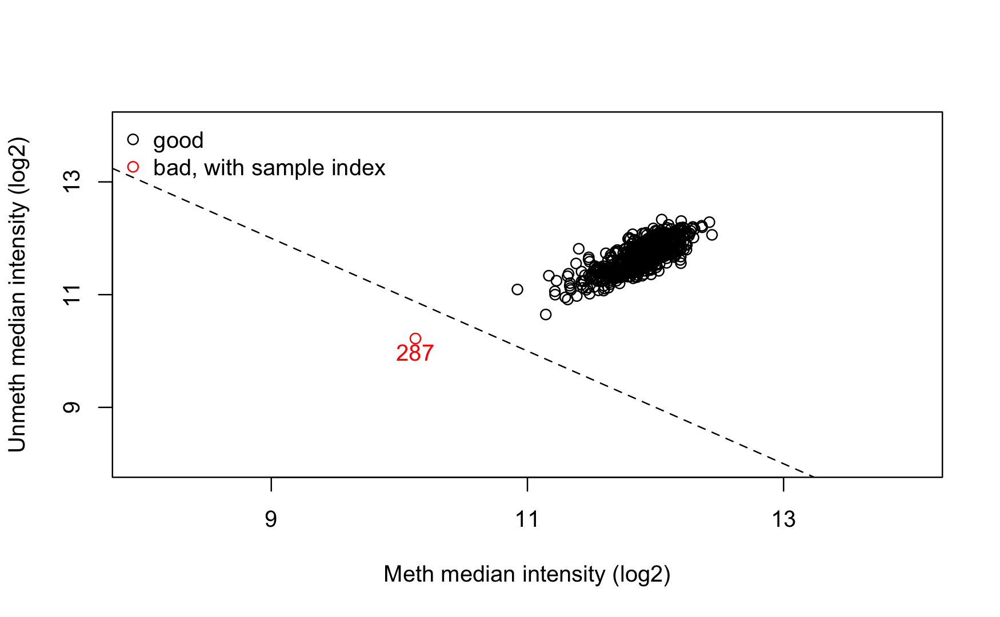
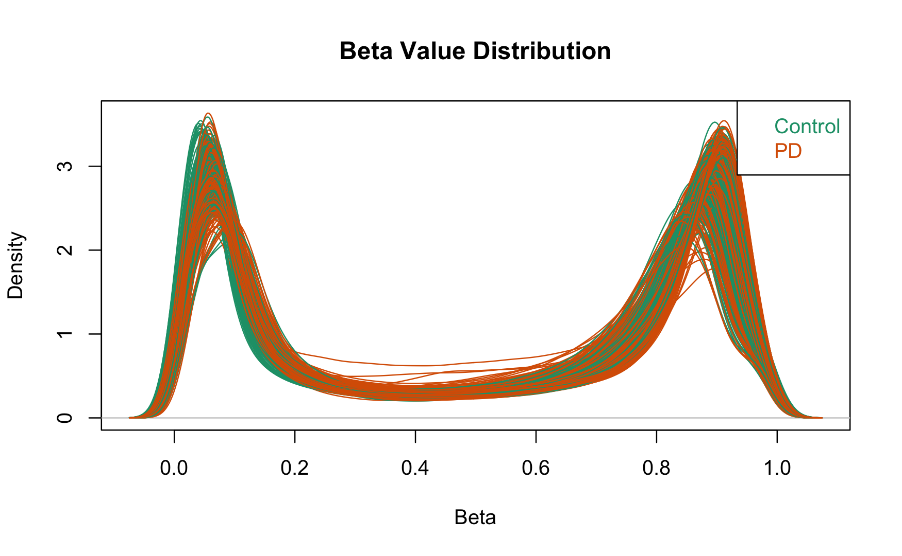
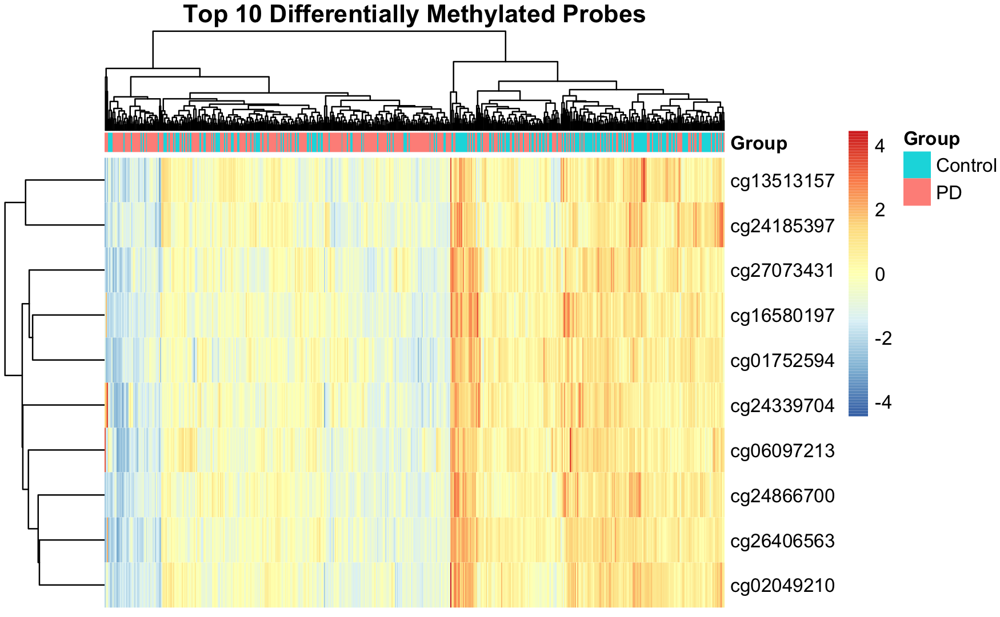

# Differential Methylation Analysis Example (GSE111629)

### 1. Install the necessary packages for Normalization of raw Methylation profiling data (.idat) and Differential Analysis.

```{r}
BiocManager::install("minfi")
BiocManager::install("limma")
BiocManager::install("DMRcate")
BiocManager::install("missMethyl")
```

## Preprocessing

### 2. Import the libraries

i.  `limma` -\> For the differential analysis: It fits a linear model to the M-values of each CpG probe to statistically identify which are significantly methylated between the groups/cohorts.
ii. `IlluminaHumanMethylation450kanno.ilmn12.hg19` -\> Annotation package: It connects CpG probe IDs to the respective genomic context, like gene name, chromosome location, relation to CpG island for results interpretetion.
iii. `DMRcate` -\> Finds differentially methylated regions (DMRs) by grouping significantly altered neighbouring CpG probes, which is biologically meaningful than observing single probes.
iv. `missMethyl` -\> Provides functions for gene enrichment set analysis that are specifically designed for methylation data.
v.  `illuminaio` -\> A low-level package for reading Illumina-specific file formats .idat. It is used by minfi under the hood.

```{r}
library(tidyverse)
library(limma)
library(GEOquery)
library(illuminaio)
library(IlluminaHumanMethylation450kanno.ilmn12.hg19)
library(DMRcate)
library(missMethyl)
```

### 3. Create a sample metadata table by reading the respective GSE file

```{r}
basedir <- "./GSE111629_RAW"
targets <- read.metharray.sheet(basedir, pattern = "GPL13534_HumanMethylation450_15017482_v.1.1.csv.gz")
```

### 4. Extract phenotype data (pData) from the GEO Database

```{r}
gse <- getGEO('GSE111629', GSEMatrix = TRUE, getGPL = FALSE)
pdata <- pData(gse[[1]])
```

### 5. Get the raw .idat files to match with the sample metadata

```{r}
basedir <- './GSE111629_RAW/'
all_idat_files <- list.files(basedir, pattern = "\\.idat\\.gz$", full.names = FALSE)
basenames <- unique(gsub("_(Grn|Red).idat.gz", "", all_idat_files))
```

### 6. Build the complete sample table for minfi

```{r}
targets <- data.frame(
  Sample_Name = gsub("_.*", "", basenames),
  Basename = file.path(basedir, basenames),
  stringsAsFactors = FALSE
)
targets <- merge(targets, pdata, by.x = "Sample_Name", by.y = "row.names", all.x = TRUE)
targets$Sample_Group <- factor(targets$`disease state:ch1`)
targets <- targets %>% mutate(Sample_Group = case_when(Sample_Group == "Parkinson's disease (PD)" ~ "PD", Sample_Group == "PD-free control" ~ "Control"))
targets$Sample_Group <- as.factor(targets$Sample_Group)

```

### 7. Read the raw intensity data from the .idat files

`extended = TRUE` reads the "extended" data from the .idat files - includes also the number of beads per probe. This information is necessary for calculating the p-values later on. rgdata holds the red and green channel data for all probes and all samples

```{r}
rg_set <- read.metharray.exp(targets = targets, extended = TRUE)
saveRDS(rg_set, "rg_set.rds")
```

### 8. Perform initial quality control on raw data

i.  `preprocessRaw(rg_set)` -\> convert the green and red channel intensities `RGChannelSet` into methylated and unmethylated channel intensities (`MethylSet`) without normalization or background correction.
ii. `getQC()` -\> calculate quality control metrics from the `MethylSet`. Compute the median methylated and unmethylated intensities across all probes for each sample.
iii. `qc` -\> contains the median intensity values for each sample. Samples with low median intensities indicate poor quality or failed experiments.

```{r}
qc <- getQC(preprocessRaw(rg_set))
plotQC(qc)
```



### 9. Display the distribution of Methylation values across all samples

i.  Beta values are converted internally from raw intensities
ii. X-axis represents beta values (0=fully unmethylated; 1=fully methylated)
iii. It's good (quality) if samples from both groups show peaks near 0 and 1 - which indicates a mix of hyper- and hypo methylated probes
iv. It's not good (quality) if samples are flat or shifted which could mean technical issues.

**This plot is used to assess overall data quality and to get a first look at large-scale methylation differences between sample groups.**

```{r}
densityPlot(rg_set, sampGroups = targets$Sample_Group, main = "Beta Value Distribution")
```



#### cleanup

```{r}
rm(list = setdiff(ls(), "rg_set"))
gc(full = TRUE)

```

### 10. Normalize raw data via Normal-exponential out-of-the-band method (noob)

i.  Background correction by using the "out-of-the-band" probes, that is where the color channel doesn't match the probe design, to estimate and subtract technical background noise.
ii. `methyl_set` -\> result: contains background-corrected and dye-bias-normalized methylated (M) and unmethylated (U) signal intensities for each probe in each sample.

**This step removes major technical artifacts from the data making the methylation values more comparable across samples and suitable for downstream technical analysis**

```{r}
methyl_set <- preprocessNoob(rg_set)
```

#### cleanup

```{r}
saveRDS(methyl_set, "methyl_set.rds")
rm(rg_set)
gc(full = TRUE)
```

### 11. Quality Control to filter out technically failed probes

i.  Calculates a detection p-value for every probe in every sample, high values indicate that the signal for a probe is indistinguishable from background noise
ii. Create a logical vector by identifying probes to *keep*
iii. Subset the `methyl_set` by removing all probes that failed the detection threshold in any sample

```{r}
detP <- detectionP(readRDS("rg_set.rds"))
keep <- rowSums(detP < 0.01) == ncol(methyl_set)
methyl_set <- methyl_set[keep, ]
print(paste("Probes after detection p-value filter:", nrow(methyl_set)))
saveRDS(methyl_set, "methyl_set_filtered.rds")
```

#### cleanup

```{r}
rm(detP, keep)
gc(full = TRUE)
```

### 12. Remove Cross-Reactive Probes

**Remove probes that are not specific to one genomic location. Cross-reactive probes can hybridize to multiple places in the genome, making their methylation signals uninterpretable and introducing noise into the analysis.**

i.  Load the library that contains the annotation database specific for the 450k array with detailed information about each probe.
ii. Create a list of probes that are known to be cross-reactive by focusing on Infinium type "I" probes (`c("I")`)

```{r}
library(IlluminaHumanMethylation450kanno.ilmn12.hg19)
ann_450k <- getAnnotation(IlluminaHumanMethylation450kanno.ilmn12.hg19)
cross_reactive <- ann_450k$Name[ann_450k$Probe_Type %in% c("I") & ann_450k$MASK_general == TRUE]
methyl_set <- readRDS("methyl_set_filtered.rds")
methyl_set <- methyl_set[!rownames(methyl_set) %in% cross_reactive, ]
print(paste("Probes after removing cross-reactive probes:", nrow(methyl_set)))
```

#### cleanup

```{r}
rm(methyl_set)
gc(full = TRUE)
```

### 13. Remove probes on sex chromosomes

```{r}
methyl_set <- readRDS("methyl_set_filtered.rds")
ann_450k_sub <- ann_450k[rownames(methyl_set), ]
keep_auto <- !(ann_450k_sub$chr %in% c("chrX", "chrY"))
methyl_set <- methyl_set[keep_auto, ]
print(paste("Probes after removing sex chromosomes:", nrow(methyl_set)))
saveRDS(methyl_set, "methyl_set_filtered_chrom.rds")
```

#### cleanup

```{r}
rm(methyl_set)
gc(full = TRUE)
```

### 14. Extract the primary metrics for methylation: Beta and M values

**Creates 2 representations of the same data. Use M-values for statistical testing, and Beta-values to visualize and interpret the magnitude of those differences**

i.  `Beta = M / (M + U + offset)` offset is to prevent divide-by-zero errors. Describes proportion of methylation and suitable for visualizations.
ii. `M-value = log2(M / U)`. Approx. normal distribution thus suitable for statistical testing in differential analysis.

```{r}
methyl_set <- readRDS("methyl_set_filtered_chrom.rds")
beta_matrix <- getBeta(methyl_set)
m_values <- getM(methyl_set)
saveRDS(beta_matrix, "beta_matrix.rds")
saveRDS(m_values, "m_values.rds")
```

#### cleanup

```{r}
rm(methyl_set)
gc(full = TRUE)
```

## Differential Methylation Analysis

### 15. Setup statistical modelling

```{r}
design <- model.matrix(~0 + targets$Sample_Group)
colnames(design) <- levels(targets$Sample_Group)
```

### 16. Fit linear model

```{r}
fit <- lmFit(m_values, design)
```

### 17. Define the contrast

**Define the specific comparison to be tested in the differential analysis**

```{r}
cont.matrix <- makeContrasts(Parkinsons_vs_Control = PD - Control, levels = design)
```

### 18. Apply the contrast to the linear model

```{r}
fit2 <- contrasts.fit(fit, cont.matrix)
```

### 19. Apply empirical Bayes moderation

```{r}
fit2 <- eBayes(fit2)
```

### 20. Extract Differential Analysis results

**Also check how many probes are statistically significant (FDR value)**

```{r}
results <- topTable(fit2, number = Inf, coef = "Parkinsons_vs_Control")
sum(results$adj.P.Val < 0.05)
dim(results)
```

### 21. Add annotations to the results

```{r}
results$ProbeID <- rownames(results)
ann_sub <- ann_450k[rownames(results), c("chr", "pos", "UCSC_RefGene_Name", "UCSC_RefGene_Group", "Relation_to_Island")]
annotated_results <- merge(results, ann_sub, by.x = "ProbeID", by.y = "row.names")
annotated_results <- annotated_results[order(annotated_results$adj.P.Val), ]
write.csv(annotated_results, "differential_methylation_results.csv", row.names = FALSE)
```

### 22. Visualize Differential Methylation results in a volcano plot

```{r}
library(ggplot2)
volcano_plot <- ggplot(annotated_results, aes(x = logFC, y = -log10(P.Value))) +
  geom_point(alpha = 0.6, aes(color = adj.P.Val < 0.05)) +
  geom_hline(yintercept = -log10(0.05), linetype = "dashed") +
  geom_vline(xintercept = c(-1, 1), linetype = "dashed") +
  ggtitle("Volcano Plot of Differential Methylation") +
  theme_minimal()
print(volcano_plot)
```

### 23. Visualize a Heatmap with the 10-top most methylated probes

```{r}
library(pheatmap)
top_probes <- annotated_results$ProbeID[1:10]
top_beta <- beta_matrix[rownames(beta_matrix) %in% top_probes, ]

annotation_col <- data.frame(Group = targets$Sample_Group)
rownames(annotation_col) <- colnames(top_beta)

pheatmap(top_beta,
         annotation_col = annotation_col,
         show_rownames = T,
         show_colnames = F,
         main = "Top 10 Differentially Methylated Probes",
         scale = "row")

```


